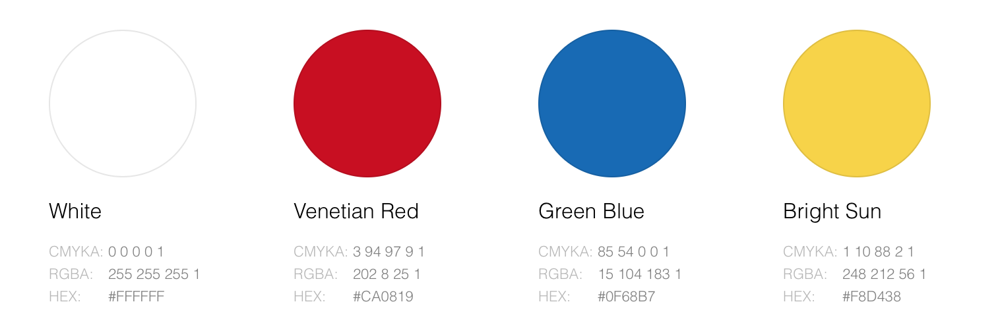
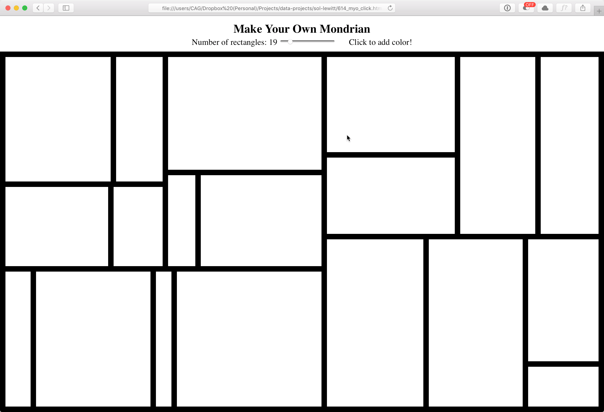

# Make Your Own Mondrian

- Built with [d3.tree](https://github.com/d3/d3-hierarchy/blob/master/README.md#tree)
- Randomly generates rectangle patterns
- Adjust the size with a slider
- Click to add colors!

`index.html` is the "make your own" version.
`random_version.html` is the version that randomly generates the colors for you.

## To Do List
- [x] Proof of concept
- [ ] Better styling
- [ ] Image download

Contributions welcome!

### Color Palette

### Preview

